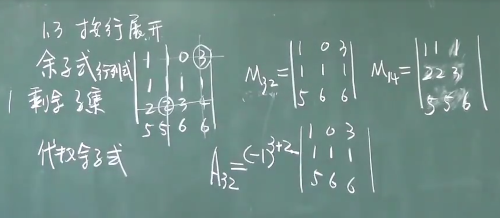
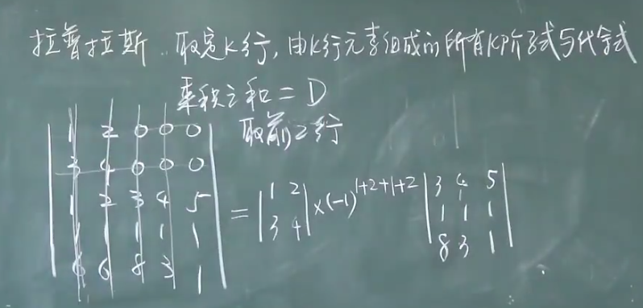

# 线性代数笔记

## 1.行列式

### 1.1 二阶行列式和三阶行列式

1. 二阶行列式是什么

2. 二阶行列式中如何表示第几行和第几列

3. 主对角线和副对角线是哪一条

4. 三阶行列式是什么

5. 三阶行列式的对角线法则

6. 克拉默法则
   $$
   x_i = D_i/D(第i列换成b_i)
   $$
   

7. 沙路法

### 1.2 n阶行列式

#### 1.2.1 排列与逆序数

1. 全排列(排列)的定义

   ** **

2. 1,  2, 3 可以组成多少种排列

3. 自然排列(标准排列是什么), 什么是标准次序

4. 逆序的定义

5. 逆序数的定义

6. 奇排列是什么, 偶排列是什么

#### 1.2.2 对换

1. 对换的定义
2. 相邻对换的定义
3. 一个定理和两个推论

### 1.2.3 n阶行列式的定义

1. n阶行列式的三种定义模式
2. 三角形行列式

### 行列式的性质

1. 性质1
   $$
   D^T = D
   $$

* 推论:对行成立的性质对列也成立(交换行列)

2. 性质2:两行互换值变号(列标没变,行标对换)

3. 性质3:两行相等, D = 0(D = -D)
4. 性质4:某一行都乘以K,等于用k乘以D
5. 性质5:行列式两行成比例,D等于零(性质3 + 性质4)

* 推论: 某一行为0, D = 0

6. 性质6: D中是和的那一行分开, 其余行保持不变

7. 性质7(重点): 某一行乘以一个数加到另一行上去, 行列式的值不变(根据性质6分开的有性质3)

* 解题常用正三角,将有1的放在第一行

### 1.3按行展开

1. 余子式(按行(列)展开)
2. 代数余子式

* D = 某行元素 * 自己的代数余子式

* 定理1(异乘变0):  某行元素与另一行元素的代数余子式乘积之和为0

3. 拉普拉斯定理:取定K行由K行元素组成的所有K阶余子式与代数余子式乘积之和=0

4. 行列式相乘(行乘列)
