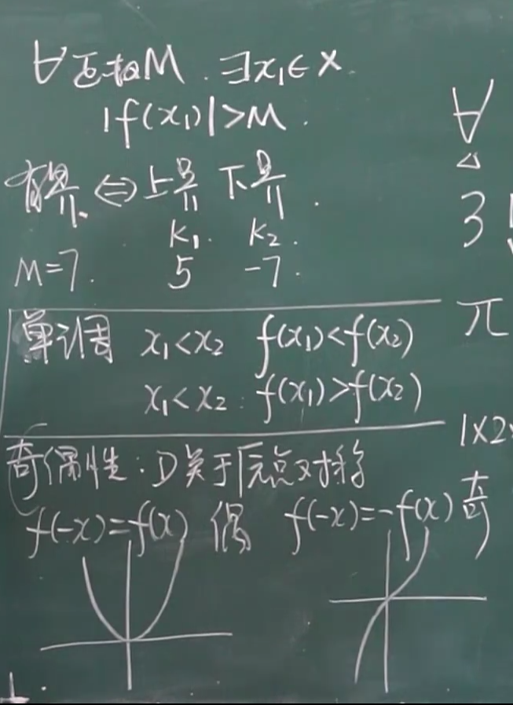

# 函数

## 1.1 函数与极限

### 1.1.1 映射

1. 映射:X,Y为非空集合, 法则f,对X中每个元素x,唯一的y与之对应
2. f: X -> Y,X为原像, Y为像
3. 定义域

$$
D_f:domain
$$

​		值域
$$
R_f:range
$$

4. 

5. 复合映射

### 1.1.2函数

1. 函数的定义

* 几个特殊函数
  1. 符号函数y = sgn x
  2. 取整函数 y = [x]
  3. 迪利克雷函数
  4. 取最值函数

#### 函数的特性

1. 有界性

* 上界
* 下界
* 有界
* 无界
* 

2. 单调性

3. 奇偶性

   

4. 周期性

### 1.1.2 反函数 ,复合函数, 初等函数

1. 反函数: 
   $$
   设f:D->f(D)单射, f^{-1}必存在,f{-1}单调
   $$

   $$
   f增, f^{-1}增, f减f^{-1}减
   $$

* 反三角函数

1. 复合函数

2. 运算

   

3. 初等函数

5. 补充
   $$
   |a|-|b|<=|a+b|<=|a|+|b|
   $$
   

## 1.2 数列极限的定义

1. 

2. 解题过程

   

#### 收敛数列的性质

1. 收敛数列的极限唯一(证明:定义+反证法)
2. 收敛数列一定有界(证明:假设法+定义+最值函数 )
3. 收敛数列具有保号性(假设法+定义)

* 推论:

4. 收敛数列的任一子数列收敛于统一极限

   [^待理解证明过程]: 

   

5. 若数列有两个子数列收敛于不同的极限, 则原数列一定发散

## 函数的极限

1. 函数极限的定义
2. f(x)极限存在 = 左右极限均存在且相等

### 函数极限的性质

1. 函数极限的唯一性
2. 局部有界性
3. 局部保号性
4. 函数极限与数列极限的关系

* 数列极限存在函数极限不一定存在